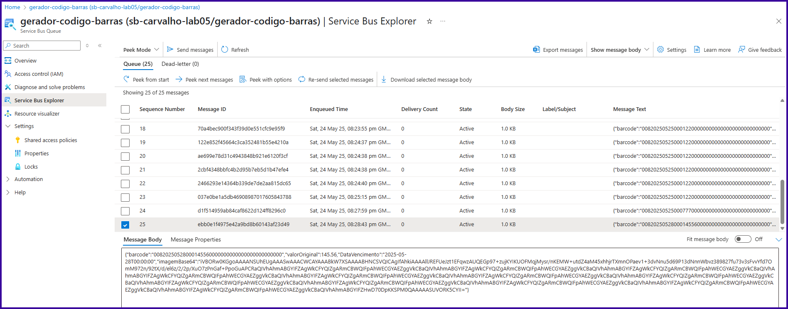
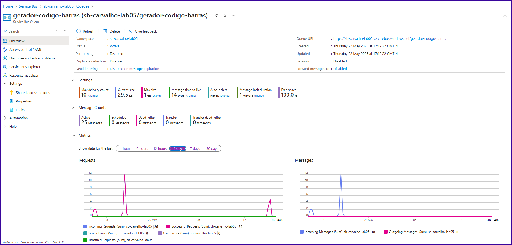
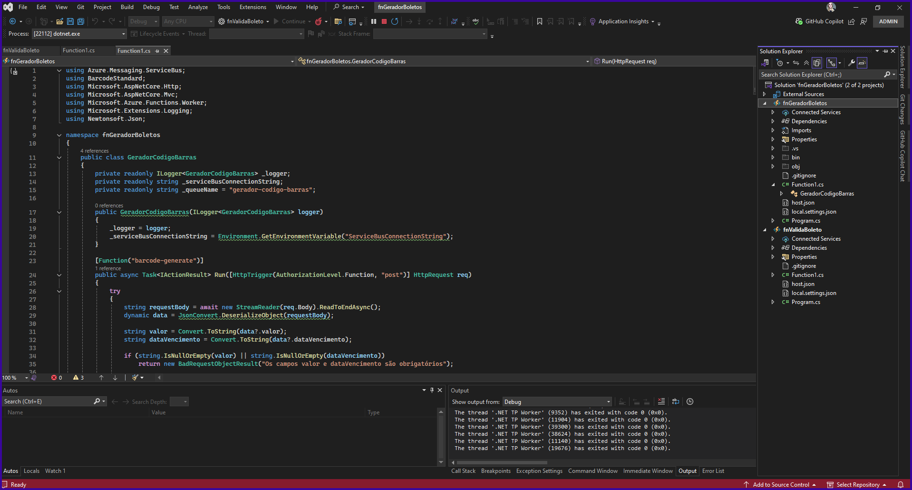
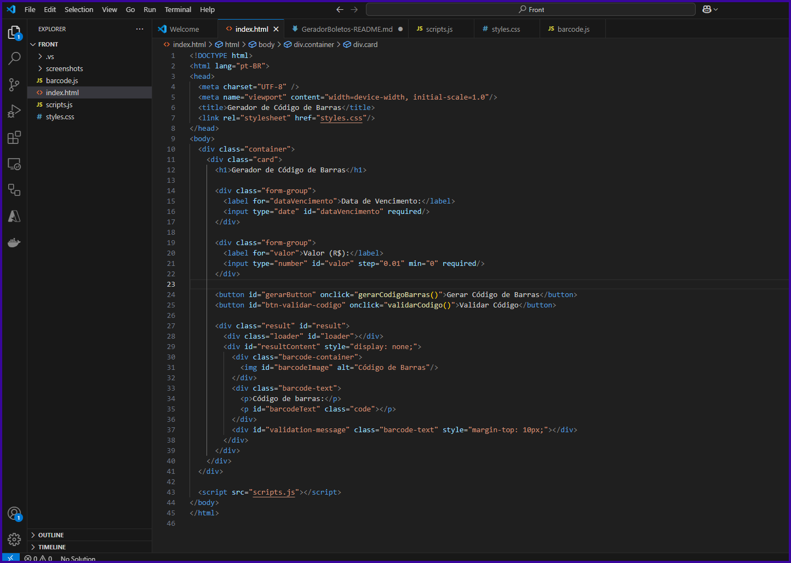
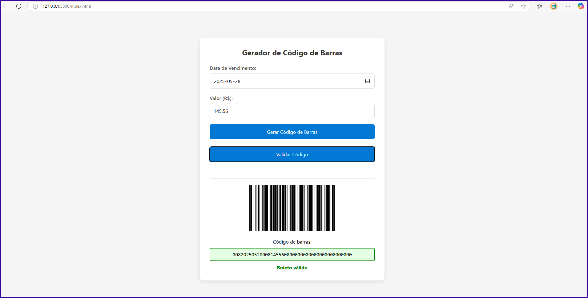

# 🧾 Gerador de Código de Barras de Boletos

Este projeto demonstra a geração de códigos de barras, renderização da imagem em PNG (Base64) e envio da mensagem para uma fila do Azure Service Bus.

## 🔧 Tecnologias Utilizadas

- **Azure Functions (.NET 8 Isolated)**
  - Classe `fnGeradorBoletos`: responsável por gerar o código de barras e retornar um objeto contendo:
    - `barcode`: código gerado
    - `valorOriginal`: valor decimal
    - `dataVencimento`: data de vencimento
    - `ImagemBase64`: representação PNG do código de barras
  - Classe `fnValidaBoleto`: para validação futura do código

- **SkiaSharp**
  - Geração e renderização da imagem de código de barras

- **Azure Service Bus**
  - Namespace: `sb-carvalho-lab05`
  - Fila: `gerador-codigo-barras`
  - Região: `Canada Central`

- **Front-end (HTML/JS/CSS)**
  - Interface intuitiva com:
    - Campo de data
    - Campo de valor
    - Botão para gerar e validar código
    - Visualização de imagem e texto do código
    - Integração com as APIs via `fetch()`

- **🔁 Fluxo resumido:**

  - Usuário clica em "Gerar Código"
  - Front faz POST /api/barcode-generate
  - Função gera código, cria imagem e envia para o Service Bus
  - Resposta JSON exibe imagem e texto na tela 
  - (Opcional) Usuário clica em "Validar Código" → chama função de validação`


## 📂 Estrutura de Pastas

```bash
📁 fnGeradorBoletos
 ├── Function1.cs
 ├── GeradorCodigoBarras.cs
 ├── local.settings.json
 └── Program.cs

📁 fnValidaBoleto
 ├── Function1.cs
 ├── local.settings.json
 └── Program.cs

📁 FRONT
 ├── index.html
 ├── scripts.js
 ├── barcode.js
 └── styles.css
```

## 🚀 Como Executar Localmente

1. Configure o `local.settings.json` para os dois projetos (`fnGeradorBoletos` e `fnValidaBoleto`) com a variável de ambiente:
   ```json
   {
     "Values": {
       "AzureWebJobsStorage": "UseDevelopmentStorage=true",
       "FUNCTIONS_WORKER_RUNTIME": "dotnet-isolated",
       "ServiceBusConnectionString": "<sua-connection-string>"
     }
   }
   ```

2. Rode os dois projetos Azure Functions localmente:
   - `func start` para cada projeto

3. Abra o `index.html` com o Live Server no VS Code.

4. Use os botões para gerar e validar o código de barras.

## 💬 Observações

- As mensagens são enfileiradas em JSON incluindo imagem codificada (`ImagemBase64`) e metadados.
- A imagem pode não aparecer se o campo `ImagemBase64` estiver ausente ou inválido (verificar logs).
- A interface já está preparada para incluir validação e exibir feedback visual (classes CSS).

## 📸 Prints

- Grupo de recursos:
  

- Service Bus Explorer:
  

- Queue:
  

- Estrutura do projeto backend:
  

- Estrutura do front-end:
  

- Boleto Local:
  
---
## ✅ Autor
Heloisa
Projeto de estudo com Azure Functions, filas e interface integradas pelo curso de Azure Cloud Native DIO.